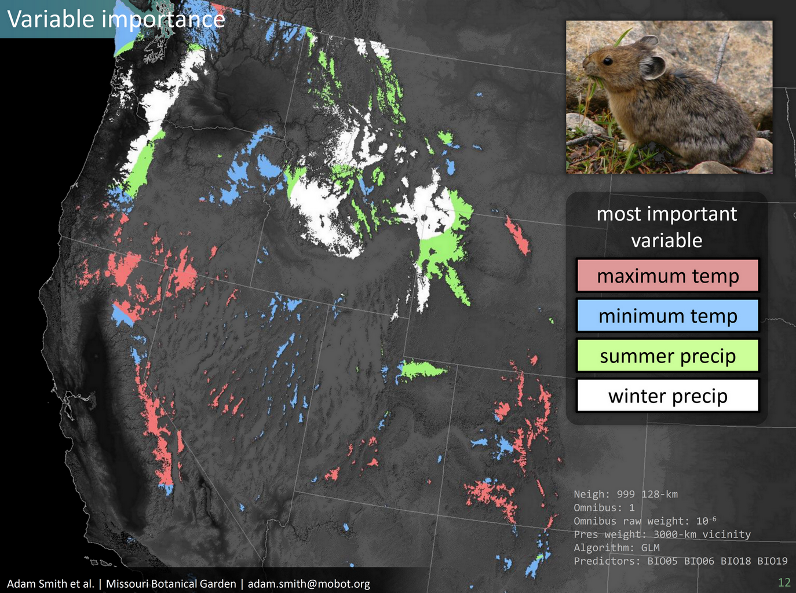

# Non-stationary species distribution modeling

Non-stationary species distribution modeling (NS-SDM) is a modeling method that accounts for how the same environmental variables vary in effect across the range of a species. Inspired by "tree"-based machine learning techniques like random forests and boosted regression trees, NS-SDM uses spatial ensembles of submodels to calibrate region-specific relationships between species and their environment. Submodels are then combined using weights dependent on number of samples, distance, and the shape of the "kernel" used to define the submodel's area of inference. Sensitivity analysis can then be applied to each sub-model to identify what variable have effect in different portions of a species' range.

